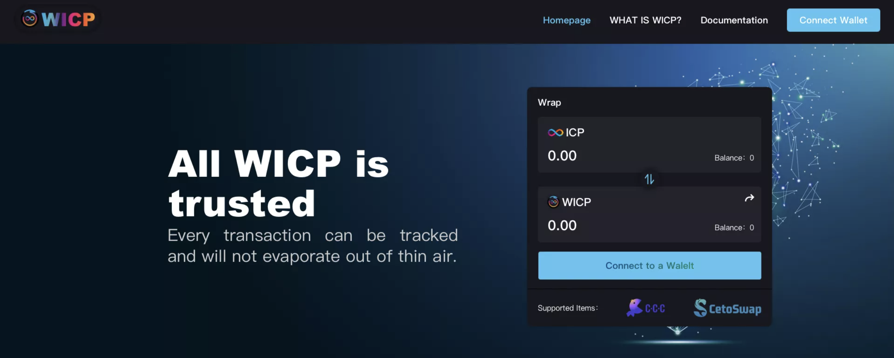

# Welcome to WICP Tool

## Official website
https://opdit-ciaaa-aaaah-aa5ra-cai.ic0.app

## Twitter

https://twitter.com/WrappedIcp

## WICP Github
https://github.com/C3-Protocol/WICP

## The current document

https://github.com/C3-Protocol/wicp_docs

## Canister ID

**Production canister id:** o5d6i-5aaaa-aaaah-qbz2q-cai

**Test canister id:** 7xlb5-raaaa-aaaai-qa2ja-cai

## Candid

https://ic.rocks/principal/o5d6i-5aaaa-aaaah-qbz2q-cai (Scroll to the bottom)

## User guide

- [Introduction](./pages/user_guide/introduction.md)

- [ICP to WICP](./pages/user_guide/icp_to_wicp.md)

- [WICP to ICP](./pages/user_guide/wicp_to_icp.md)

- [Transfer WICP](./pages/user_guide/transfer.md)

  

## Interfaces

- [balanceOf](./pages/interfaces/balanceOf.md)
- [approve](./pages/interfaces/approve.md)
- [allowance](./pages/interfaces/allowance.md)
- [transfer](./pages/interfaces/transfer.md)
- [transferFrom](./pages/interfaces/transferFrom.md)
- [batch transfer](./pages/interfaces/batch_transfer.md)
- [batch transfer from](./pages/interfaces/batch_transfer_from.md)
- [get history by account](./pages/interfaces/get_history_by_account.md)
- [swap(mint)](./pages/interfaces/swap.md)
- [burn](./pages/interfaces/burn.md)

## Examples

- [Motoko](./pages/examples/motoko.md)
- [Javascript(Coming soon)](./pages/examples/javascript.md)
- [Rust(Coming soon)](./pages/examples/rust.md)
